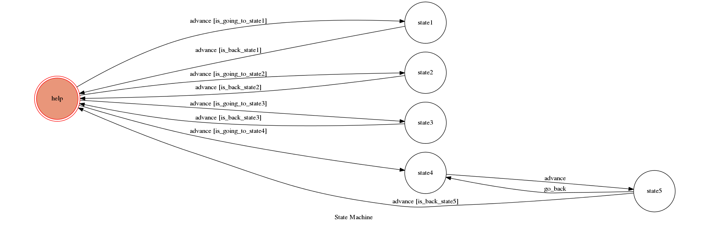

# TOC Project 2017

Template Code for TOC Project 2017

A telegram bot based on a finite state machine

## Setup

### Prerequisite
* Python 3

#### Install Dependency
```sh
pip install -r requirements.txt
```

* pygraphviz (For visualizing Finite State Machine)
    * [Setup pygraphviz on Ubuntu](http://www.jianshu.com/p/a3da7ecc5303)
    
#### Environment Setup
```sh
1. sudo apt-get install python3-pip
```
```sh
2. sudo pip3 install flask
```
```sh
3. sudo pip3 install transitions
```
```sh
4. sudo pip3 install python-telegram-bot
```
```sh
5. sudo apt-get update
```
```sh
6. sudo apt-get install graphviz pkg-config python-dev libgraphviz-dev
```
```sh
7. sudo pip3 install pygraphviz --install-option="--include-path=/usr/include/graphviz" --install-option="--library-path=/usr/lib/graphviz/" 
```

### Secret Data

`API_TOKEN` and `WEBHOOK_URL` in app.py **MUST** be set to proper values.

`FSM_URL` in fsm.py **MUST** be set to proper value.

Otherwise, you might not be able to run your code.

### Run Locally
You can either setup https server or using `ngrok` as a proxy.

**`ngrok` would be used in the following instruction**

```sh
ngrok http 5000
```

After that, `ngrok` would generate a https URL.

You should set `WEBHOOK_URL` (in app.py) to `your-https-URL/hook`.

You should set `FSM_URL` (in fsm.py) to `your-https-URL/show-fsm`.

#### Run the sever

```sh
python3 app.py
```

## Finite State Machine


## Usage
**Bot name**:

	SGFriend_bot
	
**Bot username**:

	@SGFriend_bot
	

The initial state is set to `help`.

* **State Description**
	* `help`:initial state, where you can ask bot for help.
	* `state1`:repeat mode, bot will **repeat what you said** until you say **go back**.
	* `state2`:

		image mode, bot will give you some **text** url that link to google image, 
	
		type **show fsm** will give you a **fsm picture** from **your-https-url/show-fsm**, 
	
		it will return to `help` whenever you say **go back**
	* `state3`:
	
		dictionary mode, **type some words**, it will return you a link to "word's online dictionary",
	
		**go back** make you back to `help`.
	* `state4` + `state5`:
	
		doctor mode , it will recommend you clinics around NCKU with its information , 
	
		if you think it helpful,enter **yes** and return to `help` , you can also enter **no** then it will recommend again.
	

* help
	* Input: "repeat after me"
		* Reply: "OK~ I will repeat what you said"
	* Input: "search image for me"
		* Reply: "Which image you're looking for ??"
	* Input: "dictionary"
		* Reply: "Which word you want to look up ?"
	* Input: "i feel sick"
		* Reply: "You should go to see a doctor, my dear"
		* Reply: "I suggest..."
		* Reply: "The recommend clinic's information"
		* Reply: "Helpful?"

* state1
	* Input: "go back"
		* go back to help state
	* Input: "xxx"
		* Reply: "xxx"

* state2
	* Input: "go back"
		* go back to help state
	* Input: "show fsm"
		* Reply: "Your URL/show-fsm"
	* Input: "xxx"
		* Reply: google image website search xxx

* state3
	* Input: "go back"
		* go back to help state
	* Input: "xxx"
		* Reply: xxx dictionary web page

* state4 + state5
	* Input: "yes"
		* Return to help state
	* Input: "no"
		* Back to state4 and recommend again


## Co-Auther
 [JUI-LUNG,HUNG](https://github.com/jjoe0303) 
 
 [Lee-W](https://github.com/Lee-W)
